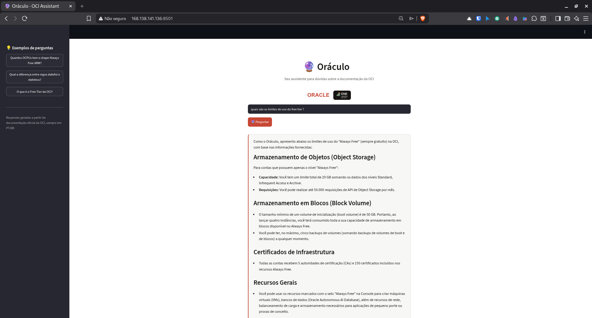

# 🔮 Oráculo — Assistente de Documentação OCI

Assistente conversacional que responde perguntas sobre a documentação oficial da Oracle Cloud Infrastructure (OCI), com respostas geradas exclusivamente a partir de uma base de conhecimento local — sem alucinação sobre temas fora do escopo.

Projeto desenvolvido como desafio final do curso **Oracle Next Education (ONE) — Challenge Alura Agente**.

---

## 🏗️ Arquitetura da Solução

```
PDF (base de conhecimento)
        │
        ▼
   loader.py  ──► extração de texto (pdfplumber)
        │
        ▼
  embedder.py ──► chunking + embeddings multilíngues
        │
        ▼
   index.pkl  ──► índice vetorial local
        │
        ▼
   agent.py   ──► busca por similaridade + geração de resposta (Gemini 3.1 Flash-Lite)
        │
        ▼
     app.py   ──► interface web (Streamlit)
```

**Fluxo:** o usuário faz uma pergunta na interface → o agente busca os trechos mais relevantes na base de conhecimento (embeddings multilíngues) → o contexto recuperado é enviado ao Gemini junto com a pergunta → a resposta é gerada com base **apenas** no que está na base, e o agente declina quando a informação não está disponível.

---

## 🛠️ Tecnologias e Ferramentas

- **Python** (gerenciamento de dependências com `uv`)
- **pdfplumber** — extração de texto dos PDFs
- **Embeddings multilíngues** — indexação semântica do conteúdo
- **Google Gemini 3.1 Flash-Lite** — geração das respostas
- **Streamlit** — interface web
- **Docker** — containerização para deploy (multi-stage, imagem final ~1.7GB)
- **Oracle Cloud Infrastructure (OCI)** — hospedagem/deploy da aplicação, Compute (Always Free)

---

## 📁 Estrutura do Repositório

```
oraculo-agent/
├── docs/
│   ├── PRD.md          # requisitos do produto
│   ├── SDD.md          # design técnico da solução
│   └── ADR.md          # log de decisões técnicas e justificativas
├── docs/assets/	# screenshots da aplicação em funcionamento
├── data/kb/             # base de conhecimento (PDFs)
├── src/
│   ├── ingestion/        # loader.py, embedder.py
│   ├── agent/             # agent.py
│   └── app/                # interface Streamlit + assets (logos)
├── scripts/
│   └── build_index.py      # gera/atualiza o índice vetorial
├── main.py
├── Dockerfile
└── pyproject.toml
```

---

## ☁️ Deploy na OCI

**Ambiente:**
- Instância: `VM.Standard.E2.1.Micro` (1 OCPU, 1GB RAM) — tier Always Free
- SO: Oracle Linux 9
- Região: Brazil East (São Paulo)
- Porta exposta: `8501` (liberada na Security List)

**Estratégia de build:** a imagem foi construída localmente e transferida via `scp` para a instância, contornando as limitações de CPU/RAM da VM Always Free durante o processo de build (o `uv sync` de dependências como `sentence-transformers`/`torch` é pesado demais para 1GB de RAM). Na VM, a imagem foi apenas carregada (`docker load`) e executada:

```bash
docker run -d --name oraculo-agent -p 8501:8501 --env-file .env oraculo-agent:latest
```

### Evidência de Funcionamento



*Aplicação rodando publicamente em `http://<IP-da-instância>:8501`, respondendo com base na documentação oficial da OCI carregada na base de conhecimento.*

---

## 💬 Exemplos de Perguntas e Respostas

> **Pergunta:** O que é o Free Tier da OCI?
>
> **Resposta:** O "Free Tier" (nível gratuito) da OCI é um programa que oferece recursos de computação, armazenamento e rede sem custo na região principal da sua conta, durante toda a vida útil dela. Esses recursos, identificados na Console pelo selo "Always Free-eligible", permitem criar máquinas virtuais, bancos de dados (Oracle Autonomous AI Database) e suporte a aplicações, sendo ideais para rodar pequenos projetos ou testes de conceito.
>
> Além disso, o nível gratuito inclui:
> - **Certificados:** 5 autoridades de certificação (CAs) e 150 certificados.
> - **Armazenamento de Objetos:** 20 GB de dados e 50.000 requisições de API por mês.
> - **Rede:** Logs de fluxo de VCN (até 10 GB/mês) e até 50 conexões IPSec VPN.
> - **Monitoramento e Gestão:** Dashboards, monitoramento de performance de aplicações, envio de e-mails (3.000 por mês) e gestão de ciclo de vida de até 25 recursos.
>
> Vale lembrar que, se você estiver usando um período de teste gratuito (Free Trial) e não fizer o upgrade para uma conta paga, o uso de armazenamento é limitado a 20 GB após o fim do teste, e o que exceder esse limite poderá ser deletado.

> **Pergunta:** Quantos OCPUs tem o shape Always Free ARM?
>
> **Resposta:** Com base no documento fornecido, o shape ARM "Always Free" (referenciado como OCI Ampere A1 Compute) permite um total de **2 OCPUs** por conta. Você pode alocar essas unidades em uma única instância ou criar até duas instâncias com 1 OCPU cada.

> **Pergunta:** Quais são os limites de uso do Free Tier?
>
> **Resposta:** Como o Oráculo, apresento abaixo os limites de uso do "Always Free" (sempre gratuito) na OCI, com base nas informações fornecidas:
>
> **Armazenamento de Objetos (Object Storage)** — para contas que possuem apenas o nível "Always Free":
> - **Capacidade:** limite total de 20 GB somando os dados dos níveis Standard, Infrequent Access e Archive.
> - **Requisições:** até 50.000 requisições de API de Object Storage por mês.
>
> **Armazenamento em Blocos (Block Volume):**
> - O tamanho mínimo de um volume de inicialização (boot volume) é de 50 GB. Ao lançar quatro instâncias, você já terá consumido toda a capacidade de armazenamento em blocos disponível no Always Free.
> - No máximo cinco backups de volumes (somando backups de boot e de blocos) a qualquer momento.
>
> **Certificados de Infraestrutura:** todas as contas recebem 5 autoridades de certificação (CAs) e 150 certificados incluídos nos recursos Always Free.
>
> **Recursos Gerais:** você pode usar os recursos marcados com o selo "Always Free" na Console para criar máquinas virtuais (VMs), bancos de dados (Oracle Autonomous AI Database), além de recursos de rede, balanceamento de carga e armazenamento necessários para aplicações de pequeno porte ou provas de conceito.

> **Pergunta:** Como faço para me registrar no Free Tier?
>
> **Resposta:** Como o Oráculo, analisei a documentação fornecida e informo que ela não contém instruções ou o passo a passo sobre como realizar o registro no Free Tier da Oracle Cloud. O documento foca na descrição dos recursos disponíveis, limites de uso e categorias de contas (como Always Free e Free Trial).
>
> *(Exemplo de resposta que demonstra o comportamento esperado do agente: quando a informação não está na base de conhecimento, o Oráculo declina em vez de inventar uma resposta.)*

---

## ▶️ Como Executar o Projeto

### Pré-requisitos
- Python 3.x
- [uv](https://github.com/astral-sh/uv) instalado
- Uma `GOOGLE_API_KEY` válida (Gemini API)

### Passos

```bash
# 1. Clonar o repositório
git clone https://github.com/dammi01/oraculo-agent.git
cd oraculo-agent

# 2. Instalar dependências
uv sync

# 3. Configurar variável de ambiente
export GOOGLE_API_KEY="sua_chave_aqui"

# 4. Gerar o índice vetorial (a partir dos PDFs em data/kb/)
uv run scripts/build_index.py

# 5. Rodar a aplicação
uv run streamlit run src/app/main.py
```

A aplicação abrirá localmente em `http://localhost:8501`.

### Via Docker

```bash
docker build -t oraculo-agent .
docker run -p 8501:8501 --env-file .env oraculo-agent:latest
```

---

## 📎 Créditos

Projeto desenvolvido em colaboração com a **Alura** e **Oracle Next Education (ONE)**.

*Desenvolvido por [Michael](https://github.com/dammi01) — Challenge Alura Agente / Oracle Next Education.*
